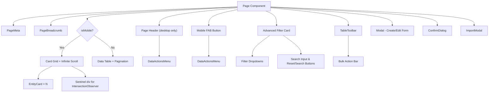

# 📘 Page Development Standard & Design Guideline

> **Reference Implementation:** [AcademicYears/index.tsx](file:///Users/m1pro2021/mhmdiamd/work/al-amanah/attendance-system/fe-attendance-system-with-cctv/src/pages/Academic/AcademicYears/index.tsx)
> **Last Updated:** 2026-06-09

This document defines the **official standard** for building any new CRUD list page in the Al-Amanah Attendance System. Every new page **MUST** follow this guideline to ensure consistency across the application.

---

## Table of Contents

1. [File Structure](#1-file-structure)
2. [Component Architecture](#2-component-architecture)
3. [Required Imports & Dependencies](#3-required-imports--dependencies)
4. [API Layer Pattern](#4-api-layer-pattern)
5. [State Management](#5-state-management)
6. [Form Validation (React Hook Form + Zod)](#6-form-validation-react-hook-form--zod)
7. [Page Layout Structure](#7-page-layout-structure)
8. [Desktop View — Data Table](#8-desktop-view--data-table)
9. [Mobile View — Card Grid](#9-mobile-view--card-grid)
10. [Mobile Card Anatomy](#10-mobile-card-anatomy)
11. [Toolbar Configuration](#11-toolbar-configuration)
12. [Selection & Bulk Operations](#12-selection--bulk-operations)
13. [Export Feature (Excel + PDF)](#13-export-feature-excel--pdf)
14. [Import Feature (Excel Upload)](#14-import-feature-excel-upload)
15. [Template Download Feature](#15-template-download-feature)
16. [Modal (Create/Edit Form)](#16-modal-createedit-form)
17. [Confirm Dialog](#17-confirm-dialog)
18. [Toast Notifications](#18-toast-notifications)
19. [Pagination (Desktop)](#19-pagination-desktop)
20. [Infinite Scroll (Mobile)](#20-infinite-scroll-mobile)
21. [Loading & Empty States](#21-loading--empty-states)
22. [Responsive Breakpoint Rules](#22-responsive-breakpoint-rules)
23. [Dark Mode Support](#23-dark-mode-support)
24. [Checklist for New Pages](#24-checklist-for-new-pages)

---

## 1. File Structure

Every page MUST follow this directory structure:

```
src/pages/{Module}/{PageName}/
├── index.tsx              # Main page component (table + mobile cards + modals)
└── {PageName}Card.tsx     # Mobile card component (used only on mobile)
```

**Example:**
```
src/pages/Academic/AcademicYears/
├── index.tsx
└── AcademicYearCard.tsx
```

> [!IMPORTANT]
> The mobile card component MUST be a **separate file**. Do NOT inline it inside `index.tsx`.

---

## 2. Component Architecture



### Reusable Components Registry

| Component | Path | Purpose |
|-----------|------|---------|
| `PageMeta` | [PageMeta.tsx](file:///Users/m1pro2021/mhmdiamd/work/al-amanah/attendance-system/fe-attendance-system-with-cctv/src/components/atoms/PageMeta.tsx) | SEO `<title>` and `<meta>` tags |
| `PageBreadcrumb` | [PageBreadcrumb.tsx](file:///Users/m1pro2021/mhmdiamd/work/al-amanah/attendance-system/fe-attendance-system-with-cctv/src/components/molecules/PageBreadcrumb.tsx) | Breadcrumb navigation + page title |
| `TableToolbar` | [TableToolbar.tsx](file:///Users/m1pro2021/mhmdiamd/work/al-amanah/attendance-system/fe-attendance-system-with-cctv/src/components/molecules/TableToolbar.tsx) | Search, filters, export/import, bulk actions |
| `Table` | [Table.tsx](file:///Users/m1pro2021/mhmdiamd/work/al-amanah/attendance-system/fe-attendance-system-with-cctv/src/components/atoms/Table.tsx) | `<Table>`, `<TableHeader>`, `<TableBody>`, `<TableRow>`, `<TableCell>` |
| `Modal` | [Modal.tsx](file:///Users/m1pro2021/mhmdiamd/work/al-amanah/attendance-system/fe-attendance-system-with-cctv/src/components/molecules/Modal.tsx) | Generic modal with title, description, footer |
| `ImportModal` | [ImportModal.tsx](file:///Users/m1pro2021/mhmdiamd/work/al-amanah/attendance-system/fe-attendance-system-with-cctv/src/components/molecules/ImportModal.tsx) | File upload modal with template download |
| `ConfirmDialog` | [ConfirmDialog.tsx](file:///Users/m1pro2021/mhmdiamd/work/al-amanah/attendance-system/fe-attendance-system-with-cctv/src/components/molecules/ConfirmDialog.tsx) | Confirmation dialogs (delete, update, create) |
| `CustomSelect` | [CustomSelect.tsx](file:///Users/m1pro2021/mhmdiamd/work/al-amanah/attendance-system/fe-attendance-system-with-cctv/src/components/molecules/CustomSelect.tsx) | Styled dropdown select |
| `DatePicker` | [DatePicker.tsx](file:///Users/m1pro2021/mhmdiamd/work/al-amanah/attendance-system/fe-attendance-system-with-cctv/src/components/molecules/DatePicker.tsx) | Date picker input |
| `Badge` | [Badge.tsx](file:///Users/m1pro2021/mhmdiamd/work/al-amanah/attendance-system/fe-attendance-system-with-cctv/src/components/atoms/Badge.tsx) | Status pills (success, error, light, etc.) |
| `Checkbox` | [Checkbox.tsx](file:///Users/m1pro2021/mhmdiamd/work/al-amanah/attendance-system/fe-attendance-system-with-cctv/src/components/atoms/Checkbox.tsx) | Styled checkbox with optional label |
| `Input` | [InputField.tsx](file:///Users/m1pro2021/mhmdiamd/work/al-amanah/attendance-system/fe-attendance-system-with-cctv/src/components/atoms/InputField.tsx) | Text input with error display |
| `Label` | [Label.tsx](file:///Users/m1pro2021/mhmdiamd/work/al-amanah/attendance-system/fe-attendance-system-with-cctv/src/components/atoms/Label.tsx) | Form field labels |
| `Button` | [Button.tsx](file:///Users/m1pro2021/mhmdiamd/work/al-amanah/attendance-system/fe-attendance-system-with-cctv/src/components/atoms/Button.tsx) | Styled button with variants |
| `Dropdown` | [Dropdown.tsx](file:///Users/m1pro2021/mhmdiamd/work/al-amanah/attendance-system/fe-attendance-system-with-cctv/src/components/molecules/Dropdown.tsx) | Generic dropdown container |
| `DropdownItem` | [DropdownItem.tsx](file:///Users/m1pro2021/mhmdiamd/work/al-amanah/attendance-system/fe-attendance-system-with-cctv/src/components/atoms/DropdownItem.tsx) | Dropdown menu item |
| `SkeletonTable` | [SkeletonRow.tsx](file:///Users/m1pro2021/mhmdiamd/work/al-amanah/attendance-system/fe-attendance-system-with-cctv/src/components/molecules/SkeletonRow.tsx) | Loading skeleton rows for tables |

### Icons (from [Icons/index.ts](file:///Users/m1pro2021/mhmdiamd/work/al-amanah/attendance-system/fe-attendance-system-with-cctv/src/components/atoms/Icons/index.ts))

Always import icons from the centralized Icons barrel:
```tsx
import { PlusIcon, PencilIcon, TrashBinIcon, CalenderIcon, ... } from "../../../components/atoms/Icons";
```

### Hooks

| Hook | Path | Purpose |
|------|------|---------|
| `useDebounce` | [useDebounce.ts](file:///Users/m1pro2021/mhmdiamd/work/al-amanah/attendance-system/fe-attendance-system-with-cctv/src/hooks/useDebounce.ts) | Debounce search input (500ms) |
| `useConfirm` | [useConfirm.ts](file:///Users/m1pro2021/mhmdiamd/work/al-amanah/attendance-system/fe-attendance-system-with-cctv/src/hooks/useConfirm.ts) | Promise-based confirmation dialogs |

---

## 3. Required Imports & Dependencies

Every page MUST import and use the following:

```tsx
// ─── React & Libraries ───
import React, { useState, useEffect, useRef, useCallback } from "react";
import { useForm, Controller } from "react-hook-form";
import { zodResolver } from "@hookform/resolvers/zod";
import * as z from "zod";

// ─── API Layer ───
import { useEntities, useEntitiesInfinite, useImportEntities } from "../../../api/hooks/useEntity";
import { EntityType } from "../../../api/types/entity";
import { entityService } from "../../../api/services/entityService";

// ─── Layout Components ───
import PageMeta from "../../../components/atoms/PageMeta";
import PageBreadcrumb from "../../../components/molecules/PageBreadcrumb";

// ─── Table Components ───
import { Table, TableBody, TableCell, TableHeader, TableRow } from "../../../components/atoms/Table";
import TableToolbar from "../../../components/molecules/TableToolbar";
import { SkeletonTable } from "../../../components/molecules/SkeletonRow";

// ─── Form & Modal Components ───
import Modal from "../../../components/molecules/Modal";
import CustomSelect from "../../../components/molecules/CustomSelect";
import ImportModal from "../../../components/molecules/ImportModal";
import DatePicker from "../../../components/molecules/DatePicker";
import Input from "../../../components/atoms/InputField";
import Label from "../../../components/atoms/Label";
import Checkbox from "../../../components/atoms/Checkbox";
import Badge from "../../../components/atoms/Badge";

// ─── Dialogs & Feedback ───
import ConfirmDialog from "../../../components/molecules/ConfirmDialog";
import { useConfirm } from "../../../hooks/useConfirm";
import { showSuccess, showError } from "../../../utils/toast";

// ─── Mobile Card ───
import EntityCard from "./EntityCard";

// ─── Hooks ───
import { useDebounce } from "../../../hooks/useDebounce";

// ─── Icons ───
import {
  PlusIcon, PencilIcon, TrashBinIcon, ChevronLeftIcon,
  ChevronUpIcon, ChevronDownIcon, AngleRightIcon,
  // + any page-specific icon
} from "../../../components/atoms/Icons";
```

---

## 4. API Layer Pattern

### Service File (`api/services/entityService.ts`)

Every entity MUST expose these API methods:

```tsx
export const entityService = {
  // CRUD
  getEntities: async (params?) => { ... },
  createEntity: async (data) => { ... },
  updateEntity: async (id, data) => { ... },
  deleteEntity: async (id) => { ... },

  // Export
  exportEntitiesExcel: async (params?) => { /* responseType: "blob" */ },
  exportEntitiesPdf: async (params?) => { /* responseType: "blob" */ },

  // Import
  downloadEntitiesTemplate: async (withData?: boolean) => { /* responseType: "blob" */ },
  importEntities: async (file: File) => { /* multipart/form-data */ },
};
```

### Hook File (`api/hooks/useEntity.ts`)

Every entity MUST have these hooks:

```tsx
// 1. Paginated query + CRUD mutations
export const useEntities = (params?) => {
  const query = useQuery({ queryKey: ["module", "entities", params], ... });
  const createMutation = useMutation({ ... });
  const updateMutation = useMutation({ ... });
  const deleteMutation = useMutation({ ... });
  return { ...query, createMutation, updateMutation, deleteMutation };
};

// 2. Infinite query (for mobile)
export const useEntitiesInfinite = (params?) => {
  return useInfiniteQuery({
    queryKey: ["module", "entities", "infinite", params],
    queryFn: ({ pageParam = 1 }) => entityService.getEntities({ ...params, page: pageParam, limit: 10 }),
    initialPageParam: 1,
    getNextPageParam: (lastPage) => {
      const meta = lastPage?.meta;
      return meta?.page < meta?.totalPages ? meta.page + 1 : undefined;
    },
  });
};

// 3. Import mutation
export const useImportEntities = () => {
  const queryClient = useQueryClient();
  return useMutation({
    mutationFn: (file: File) => entityService.importEntities(file),
    onSuccess: () => queryClient.invalidateQueries({ queryKey: ["module", "entities"] }),
  });
};
```

---

## 5. State Management

Every page MUST manage these state variables:

```tsx
const isMobile = useIsMobile(); // breakpoint at 640px (sm)

// ── Pagination & Filters ──
const [page, setPage] = useState(1);
const [limit] = useState(10);
const [searchQuery, setSearchQuery] = useState("");
const [statusFilter, setStatusFilter] = useState(""); // or any relevant filter
const [selectedIds, setSelectedIds] = useState<Set<number | string>>(new Set());
const [isExporting, setIsExporting] = useState(false);
const debouncedSearch = useDebounce(searchQuery, 500);
const { confirm, confirmState } = useConfirm();

// ── Modal State ──
const [isModalOpen, setIsModalOpen] = useState(false);
const [isImportModalOpen, setIsImportModalOpen] = useState(false);
const [selectedEntity, setSelectedEntity] = useState<Entity | null>(null);
const [sortConfig, setSortConfig] = useState<{ key: keyof Entity; direction: "asc" | "desc" } | null>(null);
```

### `useIsMobile` Helper

> [!IMPORTANT]
> This helper MUST be declared at the top of the file (outside the component) and reused across all pages.

```tsx
function useIsMobile() {
  const [isMobile, setIsMobile] = useState(() => window.innerWidth < 640);
  useEffect(() => {
    const handleResize = () => setIsMobile(window.innerWidth < 640);
    window.addEventListener("resize", handleResize);
    return () => window.removeEventListener("resize", handleResize);
  }, []);
  return isMobile;
}
```

### `downloadBlob` Helper

```tsx
function downloadBlob(blob: Blob, filename: string) {
  const url = URL.createObjectURL(blob);
  const a = document.createElement("a");
  a.href = url;
  a.download = filename;
  a.click();
  URL.revokeObjectURL(url);
}
```

---

## 6. Form Validation (React Hook Form + Zod)

Every form MUST use `react-hook-form` with `zod` schemas:

```tsx
const entitySchema = z.object({
  code: z.string().min(1, "Code is required"),
  name: z.string().min(1, "Name is required"),
  startDate: z.string().min(1, "Start date is required"),
  endDate: z.string().min(1, "End date is required"),
  isActive: z.boolean().default(false),
}).refine((data) => new Date(data.endDate) > new Date(data.startDate), {
  message: "End date must be after start date",
  path: ["endDate"],
});

type EntityFormValues = z.infer<typeof entitySchema>;
```

### Form Hook Setup

```tsx
const {
  register,
  handleSubmit,
  control,
  reset,
  formState: { errors },
} = useForm<EntityFormValues>({
  resolver: zodResolver(entitySchema),
  defaultValues: { code: "", name: "", startDate: "", endDate: "", isActive: false },
});
```

### Error Display Pattern

```tsx
{/* Text inputs — use the `error` prop */}
<Input type="text" placeholder="..." {...register("code")} error={errors.code?.message} />

{/* Controller-wrapped fields (DatePicker, CustomSelect) — manual error */}
<Controller
  name="startDate"
  control={control}
  render={({ field }) => (
    <div className="space-y-1.5">
      <DatePicker label="Start Date" value={field.value} onChange={field.onChange} />
      {errors.startDate && <p className="text-xs text-error-500">{errors.startDate.message}</p>}
    </div>
  )}
/>
```

---

## 7. Page Layout Structure

```tsx
return (
  <>
    {/* 1. SEO */}
    <PageMeta title="Entity Name | Management" description="..." />
    <PageBreadcrumb pageTitle="Entity Name" />

    <div className="space-y-6">
      {/* 2. Page Header — HIDDEN on mobile */}
      <div className="hidden sm:flex flex-col sm:flex-row sm:items-center sm:justify-between gap-4">
        <div className="flex items-center gap-3">
          <div className="flex size-10 items-center justify-center rounded-xl bg-brand-50 text-brand-500 dark:bg-brand-500/10">
            <EntityIcon className="size-5" />
          </div>
          <div>
            <h1 className="text-xl font-bold text-gray-900 dark:text-white">Page Title</h1>
            <p className="text-sm text-gray-500 dark:text-gray-400">Description.</p>
          </div>
        </div>
        <div className="flex items-center gap-3">
          <DataActionsMenu
             isExporting={isExporting}
             isImporting={isImporting}
             onExportExcel={() => handleExportExcel()}
             onExportPdf={handleExportPdf}
             onImportClick={() => setIsImportModalOpen(true)}
             onDownloadTemplate={handleDownloadTemplate}
          />
          {/* Desktop Add Button */}
          <button onClick={() => handleOpenModal()}
            className="hidden sm:flex items-center gap-2 rounded-xl bg-brand-500 px-4 py-2.5 text-sm font-semibold text-white shadow-lg shadow-brand-500/25 transition-all hover:bg-brand-600 active:scale-[.98]">
            <PlusIcon className="fill-white size-4" /> Add New Entity
          </button>
        </div>
      </div>

      {/* 3. Mobile FAB */}
      {isMobile && (
        <div className="fixed bottom-6 right-6 z-40 flex flex-col gap-3 items-end">
          <DataActionsMenu isMobileFab={true} ... />
          <button onClick={() => handleOpenModal()} className="flex size-14 items-center justify-center rounded-full bg-brand-500 text-white shadow-[0_8px_30px_rgb(0,0,0,0.12)] shadow-brand-500/30 transition-transform active:scale-95">
             <PlusIcon className="size-6 fill-white" />
          </button>
        </div>
      )}

      {/* 4. Advanced Filter Card */}
      <div className="mb-4 rounded-2xl border border-gray-200 bg-white shadow-sm overflow-hidden dark:border-white/[0.05] dark:bg-white/[0.02]">
        <button onClick={() => setIsFilterOpen(!isFilterOpen)} className="w-full flex items-center justify-between p-5 hover:bg-gray-50 transition-colors">
            {/* Filter Toggle Content */}
        </button>
        <div className={`grid transition-[grid-template-rows,opacity] duration-300 ease-in-out ${isFilterOpen ? "grid-rows-[1fr] opacity-100" : "grid-rows-[0fr] opacity-0"}`}>
            <div className="overflow-hidden min-h-0">
                 {/* Filters Dropdowns & Search Input */}
            </div>
        </div>
      </div>

      {/* 5. Toolbar (Bulk Actions ONLY) */}
      <TableToolbar selectedCount={selectedIds.size} onClearSelection={() => setSelectedIds(new Set())} bulkActions={[{ label: "Delete Selected", icon: <TrashBinIcon />, onClick: handleBulkDelete, variant: "danger" }]} />

      {/* 6. Content — Responsive switch */}
      {isMobile ? ( <MobileCardGrid /> ) : ( <DesktopTable /> )}
    </div>

    {/* 7. Modals & Dialogs */}
    <Modal ... />
    <ConfirmDialog {...confirmState} />
    <ImportModal ... />
  </>
);
```

---

## 8. Desktop View — Data Table

### Table Container

```tsx
<div className="rounded-2xl border border-gray-200 bg-white shadow-sm dark:border-white/[0.05] dark:bg-white/[0.03]
  [&_table_thead_th:first-child]:rounded-tl-xl [&_table_thead_th:last-child]:rounded-tr-xl">
```

### Table Header

```tsx
<TableHeader className="border-b border-gray-100 bg-gray-50/60 dark:border-white/[0.05] dark:bg-white/[0.01]">
  <TableRow>
    {/* Checkbox column */}
    <TableCell isHeader className="w-10 px-4 py-3.5">
      <Checkbox checked={allSelected} onChange={toggleAll} />
    </TableCell>

    {/* Sortable column */}
    <TableCell isHeader className="px-4 py-3.5">
      <button onClick={() => handleSort("code")}
        className="flex items-center gap-1.5 text-xs font-semibold text-gray-500 dark:text-gray-400 hover:text-brand-500 uppercase tracking-wider transition-colors">
        Code <SortIcon column="code" />
      </button>
    </TableCell>

    {/* Non-sortable column */}
    <TableCell isHeader className="px-4 py-3.5 text-center text-xs font-semibold text-gray-500 dark:text-gray-400 uppercase tracking-wider">
      Status
    </TableCell>

    <TableCell isHeader className="px-4 py-3.5 text-center ...">Actions</TableCell>
  </TableRow>
</TableHeader>
```

### Table Row

```tsx
<TableRow className={`group transition-colors ${
  isSelected
    ? "bg-brand-50/60 dark:bg-brand-500/5"
    : "hover:bg-gray-50/60 dark:hover:bg-white/[0.015]"
}`}>
  {/* Checkbox */}
  <TableCell className="w-10 px-4 py-4">
    <Checkbox checked={isSelected} onChange={() => toggleOne(entity.id)} />
  </TableCell>

  {/* Code pill */}
  <TableCell className="px-4 py-4">
    <span className="inline-flex items-center rounded-lg bg-gray-100 px-2.5 py-1 text-xs font-bold tracking-wide text-gray-700 dark:bg-white/[0.06] dark:text-gray-200">
      {entity.code}
    </span>
  </TableCell>

  {/* Status badge */}
  <TableCell className="px-4 py-4 text-center">
    <Badge color={entity.isActive ? "success" : "light"}>
      {entity.isActive ? "Active" : "Inactive"}
    </Badge>
  </TableCell>

  {/* Row Actions (3-dot menu) */}
  <TableCell className="px-4 py-4 text-center">
    <RowActionMenu onEdit={() => handleOpenModal(entity)} onDelete={() => handleDelete(entity.id)} />
  </TableCell>
</TableRow>
```

### Row Action Menu (Desktop)

```tsx
const RowActionMenu = ({ onEdit, onDelete }) => {
  const [isOpen, setIsOpen] = useState(false);
  return (
    <div className="relative flex justify-center">
      <button onClick={() => setIsOpen(!isOpen)}
        className="flex size-8 items-center justify-center rounded-lg text-gray-400 transition-colors hover:bg-gray-100 hover:text-gray-700 dark:hover:bg-white/[0.05] dark:hover:text-gray-200">
        <MoreHorizontalIcon className="size-5" />
      </button>
      <Dropdown isOpen={isOpen} onClose={() => setIsOpen(false)}
        className="absolute right-0 top-full z-20 mt-1 w-32 origin-top-right rounded-xl border border-gray-200 bg-white py-1.5 shadow-lg dark:border-white/[0.07] dark:bg-gray-900">
        <DropdownItem onClick={() => { setIsOpen(false); onEdit(); }} className="...">
          <PencilIcon className="size-3.5" /> Edit
        </DropdownItem>
        <DropdownItem onClick={() => { setIsOpen(false); onDelete(); }} className="... text-error-600 ...">
          <TrashBinIcon className="size-3.5" /> Delete
        </DropdownItem>
      </Dropdown>
    </div>
  );
};
```

---

## 9. Mobile View — Card Grid

> [!IMPORTANT]
> On mobile (`< 640px`):
> - Page header is **HIDDEN** (`hidden sm:flex`)
> - "Add" button is a **Floating Action Button** (FAB) fixed at bottom-right
> - Data is rendered as **Cards**, not table rows
> - Pagination is replaced by **Infinite Scroll**

### Mobile FAB

```tsx
{isMobile && (
  <button
    onClick={() => handleOpenModal()}
    className="fixed bottom-6 right-6 z-40 flex size-14 items-center justify-center rounded-full bg-brand-500 text-white shadow-[0_8px_30px_rgb(0,0,0,0.12)] shadow-brand-500/30 transition-transform active:scale-95"
    aria-label="Add New Entity"
  >
    <PlusIcon className="size-6 fill-white" />
  </button>
)}
```

### Card Grid Layout

```tsx
{isMobile ? (
  <div className="space-y-3">
    {/* Select All bar */}
    {items.length > 0 && (
      <div className="flex items-center gap-3 px-1">
        <Checkbox checked={allSelected} onChange={toggleAll} />
        <span className="text-xs text-gray-500 dark:text-gray-400">
          {selectedIds.size > 0 ? `${selectedIds.size} selected` : "Select all"}
        </span>
      </div>
    )}

    {/* Loading / Empty / Cards */}
    {isLoading ? ( <CardSkeletons /> )
     : items.length === 0 ? ( <EmptyState /> )
     : (
      <div className="grid grid-cols-1 gap-3">
        {items.map((item) => (
          <EntityCard key={item.id} entity={item}
            isSelected={selectedIds.has(item.id)}
            onToggle={() => toggleOne(item.id)}
            onEdit={() => handleOpenModal(item)}
            onDelete={() => handleDelete(item.id)} />
        ))}
      </div>
    )}

    {/* Infinite scroll sentinel */}
    <div ref={sentinelRef} className="py-2 flex items-center justify-center">
      {isFetchingNextPage && (
        <div className="size-5 animate-spin rounded-full border-2 border-brand-500 border-t-transparent" />
      )}
      {!hasNextPage && items.length > 0 && (
        <p className="text-xs text-gray-400">All records loaded</p>
      )}
    </div>
  </div>
) : ( /* Desktop Table */ )}
```

---

## 10. Mobile Card Anatomy

> **Reference:** [AcademicYearCard.tsx](file:///Users/m1pro2021/mhmdiamd/work/al-amanah/attendance-system/fe-attendance-system-with-cctv/src/pages/Academic/AcademicYears/AcademicYearCard.tsx)

Every mobile card MUST have exactly **3 sections**:

```
┌─────────────────────────────────────────┐
│ HEADER   (gray bg, border-bottom)       │
│ [Code Pill] [Status Badge]    [✓ Check] │
├─────────────────────────────────────────┤
│ BODY     (white bg)                     │
│ ✓ Entity Name                           │
│ 📅 Jan 1, 2025 — Jun 30, 2025          │
├─────────────────────────────────────────┤
│ FOOTER   (gray bg, border-top)          │
│                    [✏️ Edit] | [🗑 Del]  │
└─────────────────────────────────────────┘
```

### Card Wrapper

```tsx
<div className={`rounded-2xl border overflow-hidden transition-all ${
  isSelected
    ? "border-brand-300 bg-brand-50/60 dark:border-brand-500/30 dark:bg-brand-500/5 shadow-sm"
    : "border-gray-200 bg-white dark:border-white/[0.06] dark:bg-white/[0.02] shadow-sm hover:border-gray-300"
}`}>
```

### Card Header

```tsx
<div className="flex items-center justify-between border-b border-gray-100 bg-gray-50/80 px-4 py-3 sm:px-5 dark:border-white/[0.05] dark:bg-white/[0.02]">
  <div className="flex items-center gap-2">
    {/* Code Pill */}
    <span className="inline-flex items-center rounded-lg bg-white px-2.5 py-1 text-xs font-bold tracking-wide text-gray-700 shadow-sm border border-gray-200 dark:border-white/[0.06] dark:bg-white/[0.05] dark:text-gray-200">
      {entity.code}
    </span>
    {/* Status Badge */}
    <Badge color={entity.isActive ? "success" : "light"}>
      {entity.isActive ? "Active" : "Inactive"}
    </Badge>
  </div>
  {/* Checkbox on the RIGHT */}
  <Checkbox checked={isSelected} onChange={onToggle} />
</div>
```

### Card Body

```tsx
<div className="px-4 py-4 sm:px-5">
  <div className="flex items-center gap-2">
    {entity.isActive && <CheckCircleIcon className="size-4 shrink-0 text-success-500" />}
    <p className="text-sm sm:text-base font-semibold text-gray-900 dark:text-white leading-tight">
      {entity.name}
    </p>
  </div>
  {/* Additional meta info */}
  <div className="mt-2 flex items-center gap-1.5 text-[11px] sm:text-xs text-gray-500 dark:text-gray-400">
    <CalenderIcon className="size-3.5 shrink-0 text-gray-400 dark:text-gray-500" />
    <span className="font-medium">{formatDate(entity.startDate)}</span>
    <span className="text-gray-300 dark:text-gray-600 px-0.5">—</span>
    <span className="font-medium">{formatDate(entity.endDate)}</span>
  </div>
</div>
```

### Card Footer — Direct Action Buttons (NOT dropdown)

> [!WARNING]
> Mobile card actions MUST be **visible buttons** in the footer. Do NOT use a 3-dot dropdown menu on mobile cards. The dropdown is only for the desktop table rows.

```tsx
<div className="flex items-center justify-end border-t border-gray-100 bg-gray-50/30 px-4 py-3 sm:px-5 dark:border-white/[0.05] dark:bg-white/[0.01]">
  <button onClick={(e) => { e.stopPropagation(); onEdit(); }}
    className="flex items-center gap-1.5 rounded-lg px-3 py-1.5 text-xs font-medium text-gray-600 hover:bg-gray-100 dark:text-gray-400 dark:hover:bg-white/[0.04]">
    <PencilIcon className="size-3.5" /> Edit
  </button>
  <div className="h-4 w-px bg-gray-200 dark:bg-white/[0.06] mx-1" />
  <button onClick={(e) => { e.stopPropagation(); onDelete(); }}
    className="flex items-center gap-1.5 rounded-lg px-3 py-1.5 text-xs font-medium text-error-600 hover:bg-error-50 dark:text-error-400 dark:hover:bg-error-500/10">
    <TrashBinIcon className="size-3.5" /> Delete
  </button>
</div>
```

---

## 11. Search & Filter (Advanced Filter Card)

Use an expandable "Advanced Filter Card" instead of putting filters directly inside the toolbar. This keeps the UI clean when there are many filters (like in Student or Employee pages).

```tsx
const [isFilterOpen, setIsFilterOpen] = useState(false);

<div className="mb-4 rounded-2xl border border-gray-200 bg-white shadow-sm dark:border-white/[0.05] dark:bg-white/[0.02] overflow-hidden">
  <button 
      onClick={() => setIsFilterOpen(!isFilterOpen)} 
      className="w-full flex items-center justify-between p-5 hover:bg-gray-50 dark:hover:bg-white/[0.02] transition-colors"
  >
      <div className="text-left">
          <div className="flex items-center gap-2 mb-1">
              <FilterIcon className="size-5 text-brand-500" />
              <h3 className="text-sm font-bold uppercase tracking-wider text-gray-800 dark:text-gray-200">
                  Search & Filter
              </h3>
          </div>
          <p className="text-xs text-gray-500 dark:text-gray-400">
              Use the criteria below to filter data based on status, type, etc.
          </p>
      </div>
      <div className="shrink-0 ml-4">
          <ChevronDownIcon className={`size-5 text-gray-400 transition-transform duration-200 ${isFilterOpen ? "rotate-180" : ""}`} />
      </div>
  </button>
  
  <div className={`grid transition-[grid-template-rows,opacity] duration-300 ease-in-out ${
          isFilterOpen ? "grid-rows-[1fr] opacity-100" : "grid-rows-[0fr] opacity-0"
      }`}>
      <div className="overflow-hidden min-h-0">
          <div className="px-5 pb-5">
              <hr className="mb-5 border-gray-100 dark:border-white/[0.05]" />
              
              <div className="grid grid-cols-1 gap-5 mb-5 sm:grid-cols-3 lg:grid-cols-5">
                  <div className="space-y-1.5">
                      <Label className="text-xs font-semibold text-gray-700 dark:text-gray-300">Status</Label>
                      <CustomSelect
                          value={statusFilter === "all" ? "" : statusFilter}
                          onChange={(val) => { setStatusFilter(val ? String(val) : "all"); setPage(1); }}
                          onClear={() => { setStatusFilter("all"); setPage(1); }}
                          placeholder="All Status"
                          options={[
                              { label: "Active", value: "ACTIVE" },
                              { label: "Inactive", value: "INACTIVE" },
                          ]}
                          className="w-full [&>button]:w-full [&>button]:h-11 [&>button]:text-sm [&>button]:rounded-xl"
                      />
                  </div>
                  {/* ... other dropdowns ... */}
              </div>

              <div className="grid grid-cols-1 gap-5 items-end md:grid-cols-3">
                  <div className="md:col-span-2 space-y-1.5">
                      <Label className="text-xs font-semibold text-gray-700 dark:text-gray-300">Search</Label>
                      <div className="relative">
                          <SearchIcon className="absolute left-3.5 top-1/2 -translate-y-1/2 size-4 text-gray-400" />
                          <input
                              type="text"
                              value={searchQuery}
                              onChange={(e) => setSearchQuery(e.target.value)}
                              onKeyDown={(e) => {
                                  if (e.key === 'Enter') {
                                      setSearchTerm(searchQuery);
                                      setPage(1);
                                  }
                              }}
                              placeholder="Search by Code, Name..."
                              className="h-11 w-full rounded-xl border border-gray-200 bg-white pl-10 pr-4 text-sm text-gray-900 transition-colors focus:border-brand-500 focus:outline-none focus:ring-1 focus:ring-brand-500 dark:border-white/[0.08] dark:bg-white/[0.02] dark:text-white"
                          />
                      </div>
                  </div>
                  <div className="flex items-center gap-3 md:col-span-1">
                      <button onClick={handleResetFilter} className="flex h-11 flex-1 items-center justify-center rounded-xl border border-gray-200 bg-white px-4 text-sm font-semibold text-gray-700 transition-colors hover:bg-gray-50 dark:border-white/[0.08] dark:bg-transparent dark:text-gray-300">
                          Reset
                      </button>
                      <button onClick={handleApplySearch} className="flex h-11 flex-1 items-center justify-center gap-2 rounded-xl bg-brand-500 px-4 text-sm font-semibold text-white transition-all hover:bg-brand-600">
                          <SearchIcon className="size-4" />
                          Search
                      </button>
                  </div>
              </div>
          </div>
      </div>
  </div>
</div>
```

---

## 11.5. Toolbar Configuration (Bulk Actions Only)

The `TableToolbar` component now purely serves as a bulk-action floating bar when items are selected. It no longer contains filters, search bars, export, or import logic.

```tsx
<TableToolbar
  selectedCount={selectedIds.size}
  onClearSelection={() => setSelectedIds(new Set())}
  bulkActions={[
    {
      label: "Delete Selected",
      icon: <TrashBinIcon className="size-3.5" />,
      onClick: handleBulkDelete,
      variant: "danger",
    },
  ]}
/>
```

---

## 12. Selection & Bulk Operations

### Selection Helpers

```tsx
const displayItems = isMobile ? infiniteItems : sortedItems;
const allSelected = displayItems.length > 0 && displayItems.every((item) => selectedIds.has(item.id));

const toggleAll = () => {
  if (allSelected) setSelectedIds(new Set());
  else setSelectedIds(new Set(displayItems.map((item) => item.id)));
};

const toggleOne = (id: number | string) => {
  setSelectedIds(prev => {
    const next = new Set(prev);
    next.has(id) ? next.delete(id) : next.add(id);
    return next;
  });
};
```

### Clear Selection on Filter Change

```tsx
useEffect(() => { setSelectedIds(new Set()); }, [page, debouncedSearch, statusFilter]);
```

### Bulk Delete

```tsx
const handleBulkDelete = async () => {
  const confirmed = await confirm({
    variant: "delete",
    title: "Delete Selected",
    message: `Delete ${selectedIds.size} item(s)? This cannot be undone.`,
  });
  if (!confirmed) return;
  for (const id of selectedIds) {
    try { await deleteMutation.mutateAsync(id); } catch { /* skip */ }
  }
  setSelectedIds(new Set());
  showSuccess("Selected items deleted.");
};
```

---

## 13. Export Feature (Excel + PDF)

```tsx
const handleExportExcel = useCallback(async (ids?: (number | string)[]) => {
  setIsExporting(true);
  try {
    const params = ids && ids.length > 0
      ? { ids: ids.join(',') }  // Selected export
      : { search: debouncedSearch || undefined, isActive: statusFilter === "" ? undefined : statusFilter === "true" };
    const blob = await entityService.exportEntitiesExcel(params);
    downloadBlob(blob, "entities.xlsx");
    showSuccess("Excel exported successfully!");
  } catch (err) {
    showError(err, "Export failed");
  } finally {
    setIsExporting(false);
  }
}, [debouncedSearch, statusFilter]);

const handleExportPdf = useCallback(async () => {
  // Same pattern as Excel, returns PDF blob
}, [selectedIds, debouncedSearch, statusFilter]);
```

> [!NOTE]
> When exporting selected items, IDs are serialized as a **comma-separated string** (`ids.join(',')`) and parsed by the backend with `.split(',')`.

---

## 14. Import Feature (Excel Upload)

```tsx
<ImportModal
  isOpen={isImportModalOpen}
  onClose={() => !importMutation.isPending && setIsImportModalOpen(false)}
  onImport={handleImport}
  onDownloadTemplate={handleDownloadTemplate}
  title="Import Entity Name"
  isImporting={importMutation.isPending}
/>
```

### Import Handler

```tsx
const handleImport = useCallback(async (file: File) => {
  try {
    const result = await importMutation.mutateAsync(file);
    if (result.errors && result.errors.length > 0) {
      showError(null, `Import done with ${result.errors.length} errors. Created: ${result.created}, Updated: ${result.updated}`);
    } else {
      showSuccess(`Import complete! Created: ${result.created}, Updated: ${result.updated}`);
    }
    setIsImportModalOpen(false);
  } catch (err) {
    showError(err, "Import failed");
  }
}, [importMutation]);
```

---

## 15. Template Download Feature

The `ImportModal` component has two template download buttons built-in:

- **Blank Template** — Empty Excel with headers and formatting
- **With Data** — Same template pre-filled with existing records

```tsx
const handleDownloadTemplate = useCallback(async (withData: boolean) => {
  try {
    const blob = await entityService.downloadEntitiesTemplate(withData);
    downloadBlob(blob, "entities-template.xlsx");
    showSuccess("Template downloaded!");
  } catch (err) {
    showError(err, "Download failed");
  }
}, []);
```

---

## 16. Modal (Create/Edit Form)

```tsx
<Modal
  isOpen={isModalOpen}
  onClose={() => setIsModalOpen(false)}
  className="max-w-md"
  title={selectedEntity ? "Update Entity" : "Add New Entity"}
  description={selectedEntity ? "Edit the details." : "Fill in the details."}
  footer={
    <div className="flex justify-end gap-3">
      <button type="button" onClick={() => setIsModalOpen(false)}
        className="rounded-xl px-4 py-2 text-sm font-medium text-gray-500 transition-colors hover:bg-gray-100 dark:hover:bg-white/[0.05]">
        Cancel
      </button>
      <button type="submit" form="entity-form"
        disabled={createMutation.isPending || updateMutation.isPending}
        className="flex items-center gap-2 rounded-xl bg-brand-500 px-5 py-2 text-sm font-semibold text-white shadow-md shadow-brand-500/20 transition-all hover:bg-brand-600 disabled:opacity-50">
        {(createMutation.isPending || updateMutation.isPending) && (
          <div className="size-3.5 animate-spin rounded-full border-2 border-white border-t-transparent" />
        )}
        {selectedEntity ? "Save Changes" : "Create"}
      </button>
    </div>
  }
>
  <form id="entity-form" onSubmit={handleSubmit(onSubmitForm)} className="space-y-4">
    {/* Form fields here */}
  </form>
</Modal>
```

### Modal Open Handler

```tsx
const handleOpenModal = (entity?: Entity) => {
  if (entity) {
    setSelectedEntity(entity);
    reset({
      code: entity.code,
      name: entity.name,
      // ... map all fields
    });
  } else {
    setSelectedEntity(null);
    reset({ code: "", name: "", ... }); // Reset to defaults
  }
  setIsModalOpen(true);
};
```

### Form Submit Handler

```tsx
const onSubmitForm = async (data: EntityFormValues) => {
  const confirmed = await confirm({
    variant: selectedEntity ? "update" : "create",
    title: selectedEntity ? "Update Entity" : "Create Entity",
    message: `Are you sure you want to ${selectedEntity ? "update" : "create"} "${data.name}"?`,
  });
  if (!confirmed) return;
  try {
    if (selectedEntity) {
      await updateMutation.mutateAsync({ id: selectedEntity.id, data });
      showSuccess(`"${data.name}" updated successfully!`);
    } else {
      await createMutation.mutateAsync(data);
      showSuccess(`"${data.name}" created successfully!`);
    }
    setIsModalOpen(false);
  } catch (error) {
    showError(error, "Failed to save");
  }
};
```

---

## 17. Confirm Dialog

Always use the `useConfirm` hook for **promise-based** confirmation:

```tsx
const { confirm, confirmState } = useConfirm();

// Usage in handlers:
const confirmed = await confirm({
  variant: "delete",   // "delete" | "update" | "create" | "warning" | "info"
  title: "Delete Item",
  message: "Are you sure? This cannot be undone.",
});
if (!confirmed) return;

// Don't forget to render it:
<ConfirmDialog {...confirmState} />
```

---

## 18. Toast Notifications

```tsx
import { showSuccess, showError } from "../../../utils/toast";

showSuccess("Record created successfully!");
showError(error, "Failed to create record");  // error can be null
```

---

## 19. Pagination (Desktop)

```tsx
{total > 0 && (
  <div className="flex flex-col gap-4 border-t border-gray-100 px-5 py-3.5 sm:flex-row sm:items-center sm:justify-between dark:border-white/[0.05]">
    <p className="text-xs text-gray-400 dark:text-gray-500">
      Showing <span className="font-semibold text-gray-600 dark:text-gray-300">
        {(page - 1) * limit + 1}–{Math.min(page * limit, total)}
      </span> of <span className="font-semibold text-gray-600 dark:text-gray-300">{total}</span>
    </p>
    <div className="flex items-center gap-1.5">
      <button onClick={() => setPage(p => Math.max(1, p - 1))} disabled={page === 1} className="...">
        <ChevronLeftIcon className="size-3.5" /> Prev
      </button>
      {/* Page number buttons */}
      {Array.from({ length: Math.min(totalPages, 5) }, (_, i) => { ... })}
      <button onClick={() => setPage(p => Math.min(totalPages, p + 1))} disabled={page === totalPages} className="...">
        Next <AngleRightIcon className="size-3.5" />
      </button>
    </div>
  </div>
)}
```

---

## 20. Infinite Scroll (Mobile)

```tsx
const sentinelRef = useRef<HTMLDivElement>(null);

useEffect(() => {
  if (!isMobile) return;
  const el = sentinelRef.current;
  if (!el) return;
  const observer = new IntersectionObserver(
    ([entry]) => {
      if (entry.isIntersecting && infiniteQuery.hasNextPage && !infiniteQuery.isFetchingNextPage) {
        infiniteQuery.fetchNextPage();
      }
    },
    { threshold: 0.1 }
  );
  observer.observe(el);
  return () => observer.disconnect();
}, [isMobile, infiniteQuery]);
```

---

## 21. Loading & Empty States

### Desktop Skeleton

```tsx
<SkeletonTable cols={5} hasCheckbox rows={limit} />
```

### Mobile Card Skeleton

```tsx
<div className="grid grid-cols-1 gap-3">
  {[...Array(4)].map((_, i) => (
    <div key={i} className="rounded-2xl border border-gray-200 bg-white p-4 dark:border-white/[0.06] dark:bg-white/[0.02] animate-pulse space-y-3">
      <div className="flex justify-between">
        <div className="h-4 w-24 rounded-md bg-gray-200 dark:bg-white/[0.06]" />
        <div className="h-4 w-16 rounded-md bg-gray-200 dark:bg-white/[0.06]" />
      </div>
      <div className="h-4 w-3/4 rounded-md bg-gray-200 dark:bg-white/[0.06]" />
      <div className="h-3 w-1/2 rounded-md bg-gray-200 dark:bg-white/[0.06]" />
    </div>
  ))}
</div>
```

### Empty State

```tsx
<div className="flex flex-col items-center gap-3 py-16 text-gray-400">
  <div className="flex size-14 items-center justify-center rounded-2xl bg-gray-50 dark:bg-white/[0.03]">
    <EntityIcon className="size-7 opacity-30" />
  </div>
  <p className="text-sm font-medium text-gray-600 dark:text-gray-300">No items found</p>
  <button onClick={() => handleOpenModal()}
    className="flex items-center gap-1.5 rounded-lg bg-brand-50 px-3 py-1.5 text-xs font-medium text-brand-600 hover:bg-brand-100 dark:bg-brand-500/10 dark:text-brand-400">
    <PlusIcon className="size-3 fill-current" /> Add First Item
  </button>
</div>
```

---

## 22. Responsive Breakpoint Rules

| Breakpoint | Behavior |
|------------|----------|
| `< 640px` (mobile) | Cards, infinite scroll, FAB, hidden page header, combined More menu |
| `≥ 640px` (sm+) | Table, pagination, visible page header, separate Export/Import buttons |

### Critical CSS Patterns

```css
/* Hide on mobile, show on desktop */
className="hidden sm:flex ..."

/* Show on mobile, hide on desktop */
className="sm:hidden ..."

/* Full-width on mobile, auto on desktop */
className="w-full sm:w-auto"

/* Responsive font sizes */
className="text-xs sm:text-sm"
className="text-sm sm:text-base"
className="text-lg sm:text-xl"

/* Responsive padding */
className="px-4 sm:px-5"
className="p-4 sm:p-5"
```

---

## 23. Dark Mode Support

Every element MUST include dark mode variants using:

```
dark:bg-...       dark:text-...       dark:border-...
dark:hover:bg-... dark:hover:text-...
```

### Common Dark Mode Patterns

| Light | Dark |
|-------|------|
| `bg-white` | `dark:bg-white/[0.02]` or `dark:bg-white/[0.03]` |
| `bg-gray-50` | `dark:bg-white/[0.01]` |
| `border-gray-200` | `dark:border-white/[0.06]` |
| `border-gray-100` | `dark:border-white/[0.05]` |
| `text-gray-900` | `dark:text-white` |
| `text-gray-700` | `dark:text-gray-200` or `dark:text-gray-300` |
| `text-gray-500` | `dark:text-gray-400` |
| `text-gray-400` | `dark:text-gray-500` |
| `hover:bg-gray-50` | `dark:hover:bg-white/[0.04]` |
| `bg-brand-50` | `dark:bg-brand-500/10` |
| `text-brand-600` | `dark:text-brand-400` |
| `shadow-sm` | (no dark variant needed) |

---

## 24. Checklist for New Pages

Use this checklist when building any new CRUD page:

### Files to Create/Modify

- [ ] `src/api/types/{entity}.ts` — TypeScript types and DTOs
- [ ] `src/api/services/{entity}Service.ts` — API service (CRUD + export + import + template)
- [ ] `src/api/hooks/use{Entity}.ts` — React Query hooks (paginated + infinite + import)
- [ ] `src/pages/{Module}/{PageName}/index.tsx` — Main page component
- [ ] `src/pages/{Module}/{PageName}/{PageName}Card.tsx` — Mobile card component
- [ ] Route registration in the app router

### Features Checklist

- [ ] `PageMeta` with SEO title and description
- [ ] `PageBreadcrumb` with correct navigation
- [ ] Page header with icon + title + description (desktop only, `hidden sm:flex`)
- [ ] Desktop "Add" button in page header
- [ ] Mobile FAB button (`fixed bottom-6 right-6 z-40 size-14 rounded-full bg-brand-500`)
- [ ] `TableToolbar` with search, filters, export, import, bulk actions
- [ ] `CustomSelect` filter with `w-full sm:w-auto flex-1 sm:flex-none` responsive classes
- [ ] Desktop data table with sortable headers
- [ ] Row selection via checkboxes
- [ ] Select all / deselect all
- [ ] Bulk delete with confirm dialog
- [ ] Row action menu (3-dot dropdown on desktop)
- [ ] Mobile card with Header / Body / Footer anatomy
- [ ] Card footer with visible Edit + Delete buttons (no dropdown)
- [ ] Card checkbox on the RIGHT side of the header
- [ ] Infinite scroll with `IntersectionObserver` for mobile
- [ ] Loading skeletons (desktop table + mobile cards)
- [ ] Empty state with icon + message + "Add First" button
- [ ] Create/Edit modal with react-hook-form + zod validation
- [ ] ConfirmDialog for create, update, delete actions
- [ ] Export Excel (all + selected)
- [ ] Export PDF (all + selected)
- [ ] Import Excel via `ImportModal`
- [ ] Template download (blank + with data)
- [ ] Toast notifications for success/error
- [ ] Desktop pagination (Prev / page numbers / Next)
- [ ] Dark mode support on ALL elements
- [ ] Clear selection on filter/page change
